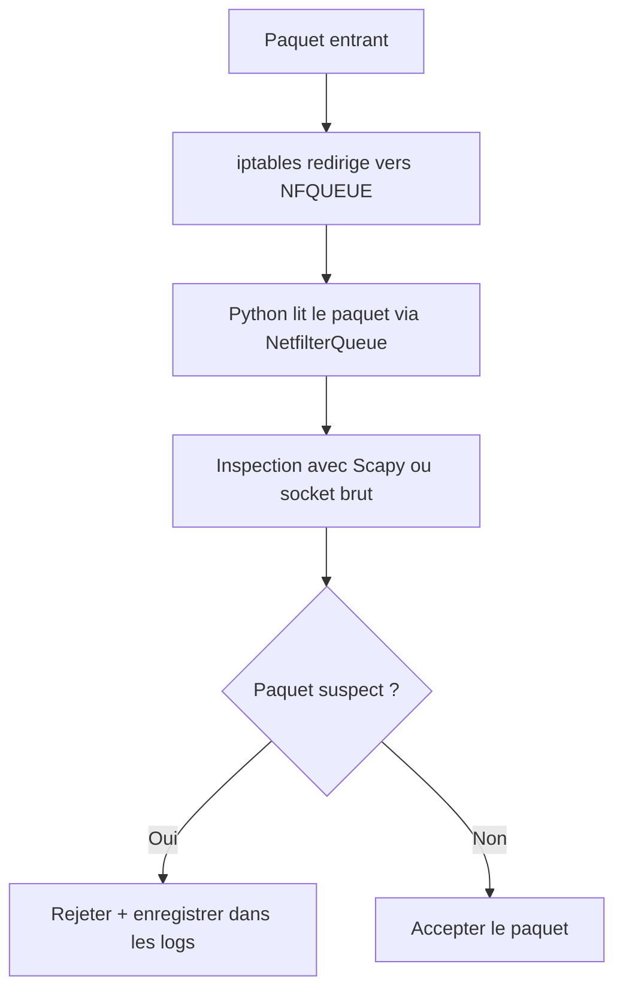
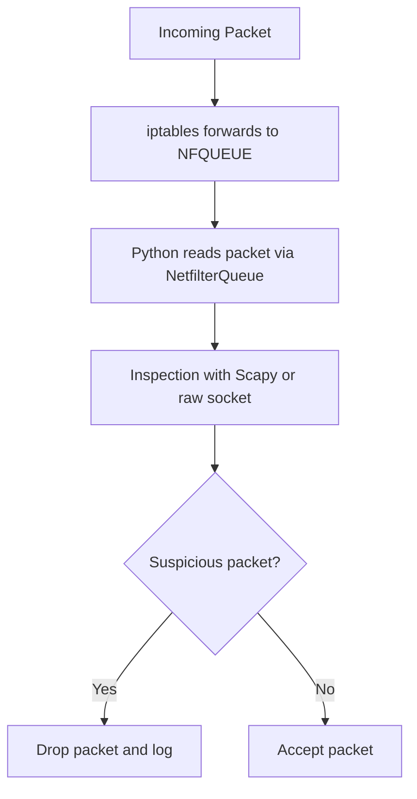

# Projet de Synthèse – Pare-feu pour VPS

## Objectif

Développer un pare-feu efficace et extensible, destiné à la protection des serveurs privés virtuels (VPS), en combinant un prototype rapide en Python avec une version finale sécurisée en Rust.

---

## Environnement cible

Le pare-feu est conçu pour fonctionner sur une machine virtuelle (VM) ou un serveur dédié tournant sous :
- **Ubuntu Server**
- **NixOS**  
(selon les besoins spécifiques du déploiement)

---

## Technologies utilisées

| Composant | Outil/Technologie | Rôle |
|----------|-------------------|------|
| 🐚 Bash  | `iptables`        | Lecture et redirection des paquets |
| 🐍 Python | `scapy`, `netfilterqueue` | Prototypage et inspection en profondeur (DPI) |
| 🦀 Rust   | `libnetfilter_queue`, `tokio` | Implémentation finale, plus rapide et sécurisée |

---

## Description du système

Le pare-feu est un **service système (daemon)** qui tourne en arrière-plan sur le serveur. Il intercepte les paquets entrants à l’aide d’`iptables`, les inspecte via une file de traitement (`NFQUEUE`), puis décide de les **accepter** ou de les **rejeter** selon des règles personnalisées.

---

## Schéma de fonctionnement

# Capstone Project – VPS Firewall

## Objective

Develop an efficient and extensible firewall designed to protect Virtual Private Servers (VPS), starting with a quick prototype in Python and evolving into a secure and high-performance version written in Rust.

---

## Target Environment

The firewall is designed to run on a virtual machine (VM) or dedicated server using:
- **Ubuntu Server**
- **NixOS**  
(depending on the specific deployment needs)

---

## Technologies Used

| Component | Tool/Technology         | Purpose                                   |
|-----------|-------------------------|-------------------------------------------|
| Bash    | `iptables`              | Packet redirection and filtering          |
| Python  | `scapy`, `netfilterqueue` | Prototyping and Deep Packet Inspection (DPI) |
| Rust    | `libnetfilter_queue`, `tokio` | Final implementation with enhanced speed and memory safety |

---

## System Description

The firewall runs as a **background service (daemon)** on the server. It intercepts incoming packets using `iptables`, inspects them through a processing queue (`NFQUEUE`), and decides whether to **accept** or **drop** them based on custom rules.

---

## Flowchart of Operation

