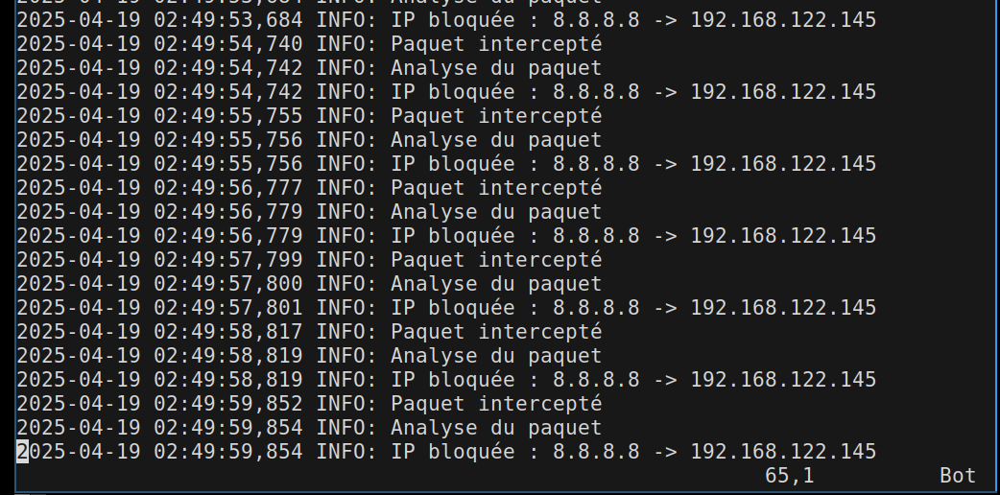

# Projet de Synthèse – Pare-feu DPI

## Objectif

Développer un pare-feu efficace et extensible, destiné à la protection des serveurs privés virtuels (VPS), en combinant un prototype rapide en Python avec une version finale sécurisée en Rust.

---

## Environnement cible

Le pare-feu est conçu pour fonctionner sur une machine virtuelle (VM) ou un serveur dédié tournant sous :
- **Ubuntu Server**

---

## Technologies utilisées

| Composant | Outil/Technologie | Rôle |
|----------|-------------------|------|
| Bash  | `iptables`        | Lecture et redirection des paquets |
| Python | `scapy`, `netfilterqueue` | Prototypage et inspection en profondeur (DPI) |

---

## Description du système

Le pare-feu est un **service système (daemon)** qui tourne en arrière-plan sur le serveur. Il intercepte les paquets entrants à l’aide d’`iptables`, les inspecte via une file de traitement (`NFQUEUE`), puis décide de les **accepter** ou de les **rejeter** selon des règles personnalisées.

---

## Schéma de fonctionnement

## shema de fonctionnement des classes

## test 
## script qui met a jour le systeme avant l'installation des dépendance

## on peut voir a la fin du script que firewall.py est lancé en daemon

## les logs des paquets vérifié sont dans firewall.log

### apres un ping google (bloqué dans config.json)

### test de commande bloqué (curl)

# Capstone Project – VPS Firewall

## Objective

Develop an efficient and extensible firewall designed to protect Virtual Private Servers (VPS), starting with a quick prototype in Python and evolving into a secure and high-performance version written in Rust.

---

## Target Environment

The firewall is designed to run on a virtual machine (VM) or dedicated server using:
- **Ubuntu Server**

---

## Technologies Used

| Component | Tool/Technology         | Purpose                                   |
|-----------|-------------------------|-------------------------------------------|
| Bash    | `iptables`              | Package redirection and filtering          |
| Python  | `scapy`, `netfilterqueue` | Prototyping and Deep Package Inspection (DPI) |

---

## System Description

The firewall runs as a **background service (daemon)** on the server. It intercepts incoming packages using `iptables`, inspects them through a processing queue (`NFQUEUE`), and decides whether to **accept** or **drop** them based on custom rules.

---

## Flowchart of Operation

## Class Workflow Diagram

